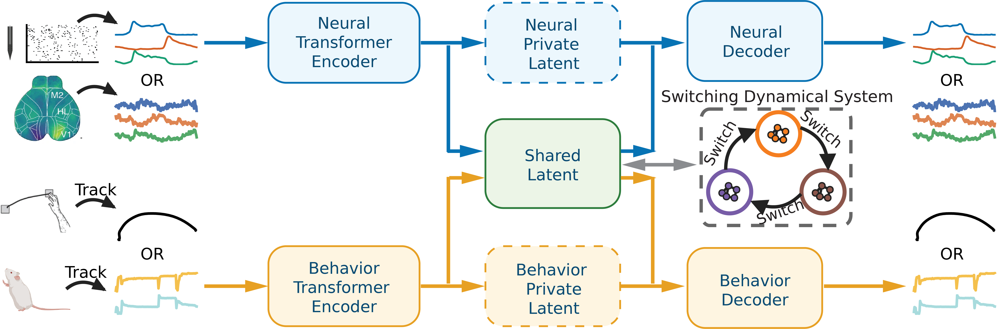

# Switching Shared Latent Dynamics (SSLD)

This repository contains the official implementation of **Switching Shared Latent Dynamics (SSLD)**. For details, please refer to our publication:

> [Learning Interpretable Switching Dynamics in Shared Neural-Behavioral Latent Space]()



---

## Installation

### 1. Clone the repository
```bash
git clone <repo-url>
cd SSLD
```

### 2. Create the conda environment
```bash
conda env create -f environment.yml
conda activate SSLD
```

> **Note:** If the environment creation fails, manually install any missing packages via `pip install <package>`. All dependencies are standard scientific Python packages.

---

## Running the Model

### Single fold (example)
```bash
python array_area2.py --config array_config.yaml --fold 0
```

### Full 5-fold run
```bash
array_run_local.bat
```
This sequentially runs all 5 folds. Note that a full run may take a significant amount of time depending on your hardware.

---

## Post-run Analysis

After completing the 5-fold run, generate figures by running:
```bash
python post_run.py
```
Output figures will be saved to the `plot/` directory.

---

## Extended Analysis

To reproduce the comparison between condition similarity and shared latent similarity (Fig. 3D and 3E), first run:
```bash
python entire_area2.py --config array_config.yaml --fold 0
```
Then generate the corresponding figures with:
```bash
python entire_post_run.py
```
